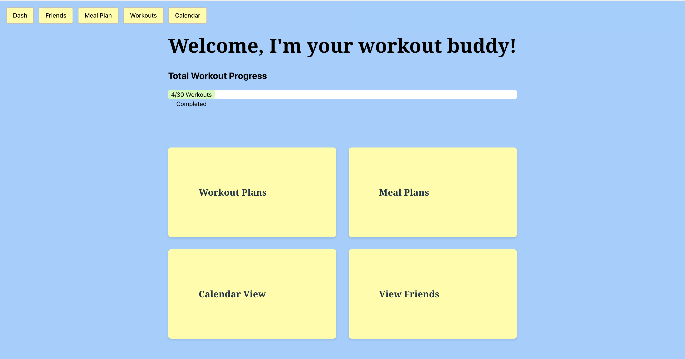
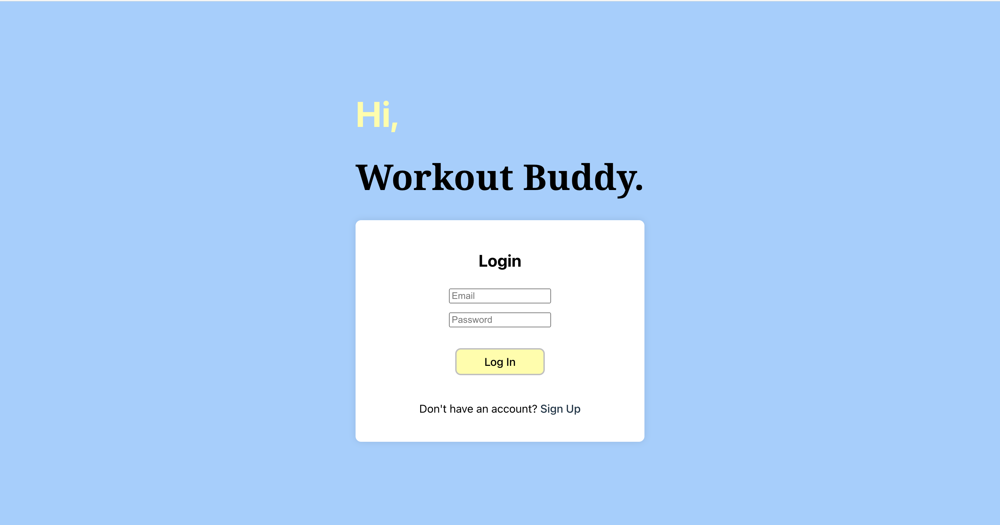

# Workout Buddy
## Table of Contents
- [Description](#description)
- [Installation](#installation)
- [Usage](#usage)
- [Acceptance Criteria](#acceptance-criteria)
- [Mock-Up](#mock-up)
- [Deployment](#deployment)

## Description
Workout Buddy is a full stack MERN SPA fitness tracking application designed to help you achieve your health and wellness goals. Whether you're a seasoned athlete or just starting your fitness journey, Workout Buddy provides the tools you need to track your meals, log workouts, connect with friends for added motivation, and organize your schedule with an intuitive calendar view. 

## Installation
- Run `npm install` on your local machine
- Make sure to add your own .env file in /backend

## Usage
To run the app: 
- Open a terminal in /frontend
- Run `npm run build`
- Open a terminal in /backend
- Run `npm start` or `node server.js` 

## Acceptance Criteria
- Use React for the front end.
- Use GraphQL with a Node.js and Express.js server.
- Use MongoDB and the Mongoose ODM for the database.
- Use queries and mutations for retrieving, adding, updating, and deleting data.
- Be deployed using Render (with data).
- Have a polished UI.
- Be responsive.
- Be interactive (i.e., accept and respond to user input).
- Include authentication (JWT).
- Protect sensitive API key information on the server.
- Have a clean repository that meets quality coding standards (file structure, naming conventions, best practices for class and id naming conventions, indentation, high-quality comments, and so on).
- Have a high-quality README (with unique name, description, technologies used, screenshot, and link to deployed application).

## Mock-Up

## Deployment
Our project is deployed on Render. You can access the app with this link: https://workout-buddy-2.onrender.com/